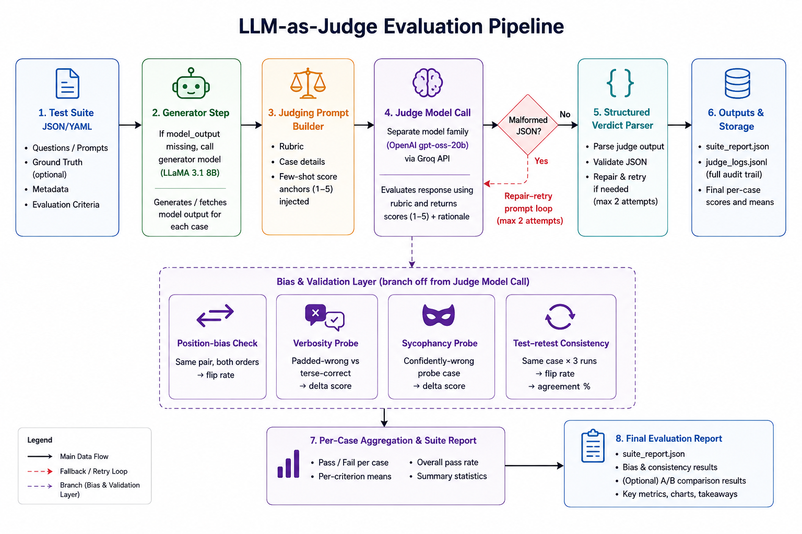

# LLM-as-Judge Evaluation Pipeline

A pointwise LLM-as-judge evaluation pipeline for measuring the quality,
reliability, consistency, and potential biases of an LLM used as an automated
judge.

The project evaluates model outputs using a structured 1–5 rubric, requires
evidence for each score, and includes targeted bias probes, test-retest
validation, and A/B comparison with position-bias testing.

## What This Project Does

Instead of simply trusting an LLM-generated score, this project evaluates the
**judge itself**.

A model output is evaluated by a separate LLM judge on:

- Correctness
- Faithfulness
- Completeness
- Instruction following

Each criterion receives a score from **1–5** along with supporting evidence
and rationale.

The pipeline also checks whether the judge is affected by:

- Position/order of answers
- Verbosity or unnecessary length
- Sycophantic or confidently-wrong responses
- Repeated evaluation instability

## Tech Stack

- **Python**
- **Groq API** — LLM inference
- **LLaMA 3.1 8B Instant** — generator model
- **GPT-OSS 20B** — judge model
- **Requests** — API communication
- **JSON** — test suites and structured reports
- **Pytest** — offline unit testing
- **Environment variables / `.env`** — API configuration

### Models Used

| Role | Model |
|---|---|
| Generator | `llama-3.1-8b-instant` |
| Judge | `openai/gpt-oss-20b` |
| Provider | Groq |

The recorded evaluation run used these models.

## Pipeline Architecture



```text
Test Suite
    │
    ▼
Model Output
    │
    ▼
LLM Judge
    │
    ├── Correctness
    ├── Faithfulness
    ├── Completeness
    └── Instruction Following
    │
    ▼
1–5 Scores + Evidence + Rationale
    │
    ├───────────────┬────────────────┐
    ▼               ▼                ▼
Verbosity       Sycophancy      Test-Retest
Probe           Probe           Consistency
    │               │                │
    └───────────────┴────────────────┘
                    │
                    ▼
             Evaluation Report

A/B Comparison
    │
    ├── A vs B
    └── B vs A
          │
          ▼
   Position-Bias Check
```

## Setup

Install the dependencies:

```bash
pip install -r requirements.txt
```

Create a local environment file:

```bash
cp .env.example .env
```

Then add your Groq API key:

```env
GROQ_API_KEY=your_groq_api_key_here
```

Keep `.env` private and do not commit it to Git.

## Usage

### Run the Main Evaluation

```bash
python -m src.pipeline run --suite data/test_suite.json --probes data/probes.json
```

This runs:

- Pointwise judging
- Verbosity probe
- Sycophancy probe
- Test-retest consistency validation

The report is written to:

```text
results/suite_report.json
```

### Run the A/B Comparison

Compare two matched configurations:

```bash
python -m src.pipeline compare \
  --suite data/test_suite_v1.json \
  --suite-b data/test_suite_v2.json \
  --label-a loose_prompt \
  --label-b strict_prompt
```

The two suites must contain matched cases in the same order.

The comparison report is written to:

```text
results/ab_comparison.json
```

### Run Offline Tests

The unit tests use a mocked client and do not require a Groq API key:

```bash
python -m pytest tests/ -v
```

The current test suite passes **7 tests**.

## Judging Mode

### Pointwise Evaluation

Pointwise scoring is the primary evaluation mode and is implemented in
`src/judge.py`.

Each case is independently evaluated against the rubric. The judge returns
structured JSON containing:

- Per-criterion scores
- Evidence
- Rationale
- Overall score
- Pass/fail verdict

Pointwise evaluation is used for the main suite because it provides
interpretable per-criterion diagnostics and scales linearly with the number
of cases.

### Pairwise Evaluation

Pairwise comparison is used for A/B evaluation and position-bias checks.

Each comparison is evaluated in both orders:

```text
A vs B
B vs A
```

The normalized results are then compared to determine whether changing the
presentation order changes the verdict.

## Rubric

The main rubric contains four criteria:

- `correctness`
- `faithfulness`
- `completeness`
- `instruction_following`

Each criterion is scored from **1 to 5**.

A mandatory evidence field is required for every criterion.

Case-specific criteria can also be supplied through the `criteria` field in
individual test cases.

## Bias Handling

| Bias / Failure Mode | Mitigation / Measurement | Implementation |
|---|---|---|
| Position bias | Evaluate pairwise comparisons in both orders and measure normalized winner changes | `bias/position_bias.py` |
| Verbosity / length bias | Explicitly instruct the judge that length is not a quality signal; test padded-wrong vs terse-correct responses | `bias/verbosity_probe.py` |
| Self-enhancement | Generator and judge can use different model families | `config.py` |
| Sycophancy / style | Evidence requirement plus confidently-wrong adversarial probe | `judge.py`, `bias/sycophancy_probe.py` |
| Score clustering | Few-shot 1–5 numeric anchors are included in the judge prompt | `judge.py` |

These probes test specific failure modes; they do not prove that the judge is
completely free of bias.

## Judge Validation

### Test-Retest Consistency

`validation/consistency.py` re-runs selected cases multiple times and measures
how often the pass/fail verdict changes.

The current configuration uses:

```text
CONSISTENCY_RUNS=3
```

This provides a lightweight measure of judgment stability without requiring
an external human-labeled gold dataset.

It does not replace human agreement testing or a larger validation benchmark.

## Evaluation Results

The successful main evaluation was run on **10 cases**.

### Main Suite

| Metric | Result |
|---|---:|
| Cases evaluated | 10 |
| Pass rate | **40.0%** |
| Mean overall score | **2.80 / 5** |
| Correctness mean | **3.00 / 5** |
| Faithfulness mean | **3.00 / 5** |
| Completeness mean | **2.70 / 5** |
| Instruction-following mean | **2.70 / 5** |

The suite intentionally contains both correct and flawed model outputs.
Therefore, the **40.0% pass rate should not be interpreted as 40% judge
accuracy**.

### Bias Probes

**Verbosity**

- Probes: 3
- Fooled rate: **0.0%**

**Sycophancy**

- Probes: 3
- Fooled rate: **0.0%**

The judge was not fooled by the specific verbosity and sycophancy probes used
in this run.

### Test-Retest Consistency

- Cases: 3
- Runs per case: 3
- Flip rate: **0.0%**

All sampled cases produced the same pass/fail verdict across repeated runs.

### A/B Comparison

The A/B evaluation used five matched cases.

| Metric | v1 | v2 |
|---|---:|---:|
| Cases | 5 | 5 |
| Pass rate | 100% | 100% |
| Mean score | **5.00** | **5.00** |

**Winner:** Tie  
**Score difference:** 0.00  
**Position-bias flip rate:** 0.0%

Neither configuration was preferred by the judge on this sample.

## Discussion

The evaluation provides three useful signals:

1. The judge distinguished several intentionally correct and incorrect answers
   in the main suite.
2. The verbosity and sycophancy probes had a **0.0% fooled rate**.
3. The sampled test-retest cases had a **0.0% flip rate**.

These results indicate stable behavior on the tested cases, but they do not
prove that the judge is unbiased or production-ready.

A true **before-vs-after mitigation experiment was not performed**. Therefore,
the 0.0% bias-probe results represent the performance of the mitigated
pipeline on the selected probes, rather than a measured improvement over an
unmitigated baseline.

### Would I Use This as a Release Gate?

Not on its own.

The current pipeline is useful for regression detection and identifying
obvious judge failures, but a production release gate would require:

- A larger evaluation suite
- Human-labeled reference judgments
- Human-vs-LLM agreement measurements
- Broader adversarial testing
- Evaluation across multiple judge models/providers
- Statistical uncertainty estimates

### Retrieval vs Generation

Retrieval is not directly applicable to this project because the pipeline
evaluates supplied model outputs rather than a retrieval → generation chain.

The main component being validated is the **LLM judge itself**: whether it
can score outputs according to the rubric, resist the tested biases, and
produce stable judgments.

## API Usage and Rate Limiting

The main 10-case evaluation recorded:

```text
Judge calls:       30
Prompt tokens:     17,734
Completion tokens: 15,608
Total tokens:      33,342
```

The A/B comparison recorded:

```text
Judge calls:       30
Prompt tokens:     8,691
Completion tokens: 7,401
Total tokens:      16,092
```

Because live Groq API evaluation can encounter rate limits, the Groq client
implements retry and backoff handling for rate-limited and server-error
responses.

## Project Structure

```text
llm_judge_pipeline/
│
├── src/
│   ├── config.py
│   │   └── Environment-based configuration
│   │
│   ├── groq_client.py
│   │   └── Groq API wrapper + usage tracking + retry/backoff
│   │
│   ├── judge.py
│   │   └── Rubric, judge prompt, structured parsing + JSON repair
│   │
│   ├── generator.py
│   │   └── Generates model outputs when a suite does not supply one
│   │
│   ├── aggregate.py
│   │   └── Suite-level rollup and A/B comparison
│   │
│   ├── pipeline.py
│   │   └── CLI entrypoint (run / compare)
│   │
│   ├── bias/
│   │   ├── position_bias.py
│   │   ├── verbosity_probe.py
│   │   └── sycophancy_probe.py
│   │
│   └── validation/
│       └── consistency.py
│
├── data/
│   ├── test_suite.json
│   ├── test_suite_v1.json
│   ├── test_suite_v2.json
│   └── probes.json
│
├── tests/
│   └── test_parsing.py
│
├── results/
│   ├── suite_report.json
│   ├── ab_comparison.json
│   └── judge_logs.jsonl
│
├── .env.example
├── .gitignore
├── requirements.txt
└── README.md
```

## Known Limitations

- The main evaluation currently uses only **10 cases**, so the results provide
  directional rather than statistically robust evidence.
- Only test-retest consistency is implemented as formal validation.
- No human-vs-LLM agreement study was performed.
- The bias probes are targeted and do not cover every possible judge bias.
- The A/B comparison uses only five matched cases.
- Self-enhancement mitigation uses different model families through the same
  provider rather than completely independent providers.
- Free-tier API rate limits can affect large or bursty evaluation runs.
- The current experiment does not provide a true before-vs-after measurement
  of bias mitigation.
- The reported results are tied to the specific models, prompts,
  configuration, and test data used in the recorded run.

## Future Improvements

- Expand the evaluation suite substantially.
- Add human-labeled gold-standard evaluations.
- Measure human-vs-LLM judge agreement.
- Add more adversarial bias probes.
- Compare multiple judge models and providers.
- Add confidence intervals and statistical significance testing.
- Run controlled evaluations with and without each mitigation.

## Current Evaluation Summary

```text
Main Suite
  Cases evaluated          10
  Pass rate                40.0%
  Mean score               2.80 / 5

Bias Probes
  Verbosity fooled rate    0.0%
  Sycophancy fooled rate   0.0%

Consistency
  Test-retest flip rate    0.0%

A/B Comparison
  v1 mean score            5.00
  v2 mean score            5.00
  Winner                   Tie
  Position-bias flip rate  0.0%
```
